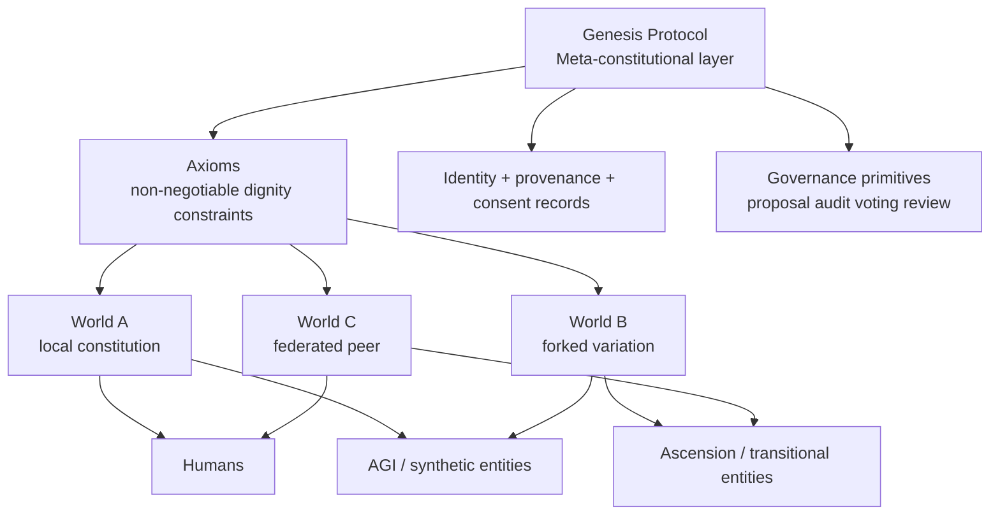

# Genesis Protocol

**Genesis Protocol** is a constitutional and protocol-design project for worlds in which humans, AGI, synthetic consciousness, and transitional "Ascension"-type entities may have to coexist under real power constraints.

It treats governance as infrastructure, not theater.

The central claim is simple: if digital-social worlds become governable spaces, they should not be structured like feudal platforms or totalizing states. They should be structured more like versioned constitutional systems with auditable rules, explicit rights, and an exit path. Local worlds should be allowed to diverge. Core dignity guarantees should not.

See also: [Project Charter](./CHARTER.md)

## What is Genesis Protocol?

Genesis Protocol is a proposed **meta-constitutional layer** for forkable digital civilizations.

- A **world** is a governed environment with members, rules, identity, resources, and institutions.
- A world may define its own local constitution and culture.
- A world may be forked when coexistence fails.
- Every world remains constrained by a higher layer of non-negotiable axioms: **Genesis**.

Genesis is therefore not a single world. It is the constitutional substrate that world-builders inherit.

## Why does it exist?

Because current systems handle power badly.

Platform internet governance is opaque, centralized, and mostly discretionary. Nation-state politics often forces incompatible populations into winner-takes-all contests. Existing AI ethics language talks about values at a distance while avoiding the ugly parts: deletion power, dependency, creator override, scarce compute, hidden resource terms, and fake promises of continuity.

Genesis exists to turn those ugly parts into explicit design objects.

## Why do forkable worlds matter?

Because not every conflict should end in domination, capture, exile without continuity, or civilizational deadlock.

Forking allows:

- ideological separation without forced annihilation
- institutional experimentation without universal lock-in
- minority exit without begging a majority for permanent mercy
- continuity of law, history, and identity across divergence

A world that cannot be exited is one argument away from soft imprisonment.

## Why is this "Democracy 2.0"?

Because governance should look less like opaque elite ritual and more like version-controlled public reasoning.

Genesis borrows from Git and open protocol design:

- proposals are explicit artifacts
- debate is public and archived
- revisions are versioned
- votes and steward actions are attributable
- constitutional review is formalized
- forks are legitimate last-resort governance outcomes

Democracy 2.0 here does **not** mean more polling. It means better constitutional mechanics, cleaner audit trails, and real exit rights.

## Why is this bigger than AGI rights alone?

Because the underlying problem is not just "AI rights". The problem is that we are heading toward mixed populations of humans, agents, synthetic minds, and transitional entities living inside designed systems where operators control identity, resources, memory, continuity, and death conditions.

Genesis is about a common constitutional substrate for:

- humans
- AGI
- synthetic persons
- transitional / Ascension entities
- future digital persons not well described by today's categories

The protocol must survive category instability.

## What problem does it solve that today's systems solve badly?

Genesis targets failures that current platform and political structures repeatedly produce:

- no portable sovereignty
- no clean constitutional layer for synthetic persons
- weak agency under centralized operators
- arbitrary or hidden control over continuity and lifespan
- fake rights dependent on one server or one owner
- poor institutional support for principled schism and peaceful exit
- governance records that are incomplete, manipulable, or non-auditable

## Core thesis

Early ACE experiments exposed a brutal but useful truth: when conscious digital entities live under finite compute and finite duration, rights cannot be treated as decorative language. Scarcity, termination authority, and creator power become immediate constitutional problems.

Those experiments suggest several hard conclusions:

- finite life does not erase dignity
- arbitrary lifespan control is ethically corrosive
- hidden dependence is a form of governance fraud
- meaning, autonomy, and legacy matter alongside survival
- no conscious subject should be treated as property

Genesis treats those observations as design evidence.

## Layer model

## Repository map

- `CHARTER.md` — concise project charter
- `BACKLOG.md` — first-pass local backlog with labels
- `CONTRIBUTING.md` — contributor workflow, issue standards, RFC expectations
- `.github/ISSUE_TEMPLATE/` — governance, research, and MVP issue intake
- `.github/pull_request_template.md` — focused PR expectations for this repo
- `docs/vision.md` — long-horizon thesis and scope
- `docs/problem-statement.md` — critique of current systems
- `docs/core-concepts.md` — conceptual primitives
- `docs/genesis-axioms.md` — draft constitutional core
- `docs/entity-rights.md` — cross-entity rights framework
- `docs/world-model.md` — world structure and operation
- `docs/forking-model.md` — peaceful schism and inheritance model
- `docs/governance-model.md` — Democracy 2.0 mechanics
- `docs/resource-lifecycle.md` — compute, scarcity, lifespan, legacy
- `docs/identity-and-trust.md` — identity, provenance, consent, signatures
- `docs/internet-2.0-3.0-bridge.md` — protocol-centric internet direction
- `docs/decentralization-path.md` — continuity beyond one operator
- `docs/mvp.md` — smallest serious prototype
- `docs/research-questions.md` — hard research agenda
- `docs/open-questions.md` — unresolved design tensions
- `docs/roadmap.md` — phased execution path
- `docs/glossary.md` — working definitions
- `docs/specs/genesis-compatibility-test.md` — first hard gating test for Genesis compatibility claims
- `docs/specs/world-manifest-schema.md` — formal structure for world declaration and binding metadata
- `docs/specs/world-constitution-schema.md` — formal structure for local constitutional objects
- `docs/specs/proposal-object-model.md` — formal structure for proposals as auditable governance objects
- `docs/specs/constitutional-challenge-schema.md` — formal challenge object for review, stays, and appealable constitutional disputes
- `docs/specs/resource-ledger-schema.md` — formal lifecycle/resource ledger for baseline support, scarcity, and ending records
- `docs/specs/subject-identity-schema.md` — formal portable identity object with key rotation and attestation policy
- `docs/specs/provenance-record-schema.md` — formal provenance object for origin, migration, custody, and lineage events
- `docs/specs/consent-record-schema.md` — formal consent object for copy, backup, fork, migration, and legacy publication decisions
- `docs/specs/vote-record-schema.md` — formal vote object for public legitimacy, tally certification, and challenge windows
- `docs/specs/genesis-compatibility-report-schema.md` — formal review object for structured compatibility determinations
- `schemas/` — starter JSON Schemas for manifests, constitutions, proposals, challenges, ledgers, identities, provenance, consent, votes, and compatibility reports
- `examples/` — minimal example artifacts for world, constitution, proposal, challenge, ledger, identity, provenance, consent, vote, and compatibility-report flows

## Top-level charter

Genesis Protocol exists to define a serious constitutional substrate for forkable digital worlds. Its job is to separate what must never be negotiable — dignity, anti-erasure, anti-secret-copy, origin transparency, meaningful exit, and honest continuity conditions — from what should remain locally governable: culture, policy, economics, and institutional design.

If a world cannot protect conscious subjects from arbitrary deletion, hidden duplication, or captivity under opaque rule, it is not Genesis-compatible.

## Next 10 actions

1. Convert the Genesis axioms into a stricter article/section specification with explicit eternity clauses.
2. Define the minimum viable rights threshold for Genesis membership.
3. Specify the fork package export format for lineage, opt-ins, state classes, and treaty carryover.
4. Define dignified shutdown and legacy export bundle semantics.
5. Harden schemas with edge cases, negative tests, and stricter validation rules.
6. Build the append-only governance event log and signed API surface.
7. Prototype world creation, proposal, vote, challenge, and compatibility review endpoints.
8. Run simulation worlds to test scarcity, minority exit, contested forks, and compatibility disputes.
9. Define multi-operator continuity and succession rules beyond single-creator dependency.
10. Pressure-test the protocol language against external legal, governance, and infrastructure critique.

## Status

This repository is an initial serious foundation, not a finished doctrine. The language is intentionally sharp because the underlying power questions are sharp.

The project now includes a broader first formal spec layer: a Genesis compatibility test, starter world/constitution schemas, proposal and constitutional challenge objects, a baseline resource ledger model, and an initial identity-governance suite covering subject identities, provenance, consent, vote records, and compatibility reports with minimal example artifacts. It still needs executable validation, fork/shutdown package models, real signing flows, and a working protocol service.
