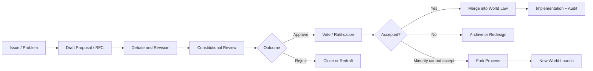

# Governance Model

Genesis Protocol proposes a governance style closer to version control than to opaque institutional mysticism.

## Democracy 2.0

Democracy 2.0 here means:

- explicit proposals
- recorded deliberation
- revisable drafts
- attributable actions
- formal constitutional review
- auditable decision history
- lawful minority exit via fork

It is not a promise that voting alone solves power.

## Governance objects

A serious system needs first-class governance objects:

- issue / problem report
- proposal / RFC
- revision history
- review comments and objections
- vote record
- constitutional challenge
- steward action record
- implementation status
- fork notice

## Proposal lifecycle

A plausible default flow:

1. Problem statement filed
2. Proposal drafted
3. Public discussion and amendment
4. Formal review for rights impact and constitutional fit
5. Vote or steward decision under published authority
6. Challenge window
7. Merge into law / policy / constitution
8. Execution and audit

## Debate, review, revision

Good governance needs structured disagreement, not performative outrage.

Every proposal should include:

- rationale
- affected rights and populations
- infrastructure impact
- reversibility assessment
- failure modes
- migration / fork implications

## Voting and legitimacy

Voting models may vary by world, but legitimacy requires clarity about:

- who can vote
- what quorum applies
- what threshold applies
- which decisions require constitutional rather than ordinary approval
- whether different entity classes require separate consent thresholds

## Minority protections

Majority rule without minority safeguards is just cleaner paperwork for domination.

Minimum protections should include:

- constitutional review of rights-impacting laws
- documented dissent rights
- delay and challenge windows
- portability and exit guarantees
- lawful fork pathway for persistent incompatibility

## Constitutional review

Worlds should maintain a review body or review procedure capable of testing proposals against Genesis axioms and the local constitution.

This body should not be omnipotent, but it must be able to stop obviously incompatible law.

## Auditable history

Governance history should be append-only or tamper-evident. At minimum, every major action should have:

- unique identifier
- timestamp
- signer(s)
- legal basis
- affected scope
- revision lineage

## Roles

### Maintainers
Responsible for operational continuity and implementation hygiene.

### Stewards
Temporary custodians of institutional power, always reviewable.

### Moderators
Handle conduct and local order under published constraints.

### Judges / Reviewers
Interpret constitution and process disputes.

### Agents
Software or hybrid entities performing governance-support functions, never beyond declared authority.

## Preventing elite capture and soft tyranny

Key mechanisms:

- hard term limits or rotation for concentrated roles
- public rationale requirements for exceptional actions
- mandatory logging of steward interventions
- independent constitutional challenge routes
- budget and resource transparency
- portable identity and exit rights
- cheap forkability when institutional trust collapses

Soft tyranny thrives when leaving is expensive and reviewing is impossible. Genesis tries to make both of those conditions harder to sustain.
